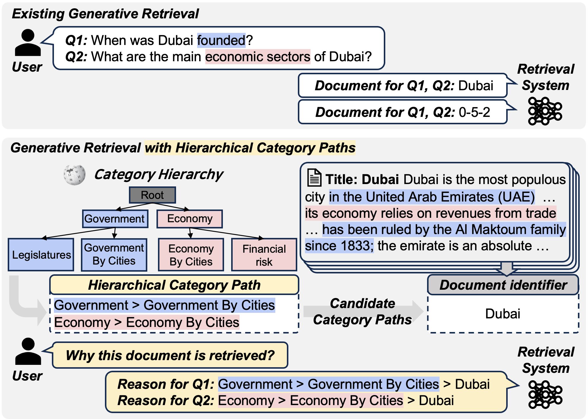

# HyPE (Hierarchical Category Path-Enhanced Generative Retrieval)
HyPE enhances explainability by generating hierarchical category paths step-by-step before decoding docid.  
It employs hierarchical category paths as explanation, progressing from broad to specific semantic categories.




## Dataset
The dataset directory contains two main datasets: NQ320K and MSMARCO, along with a backbone category hierarchy.

Each dataset directory includes path-augmented datasets that have been linked with linearized hierarchical category paths derived from the backbone category hierarchy.

In each dataset's directory, the `backbone_file` directory contains path-augmented datasets for:
1. Original training set
2. Query generation (QG) set
3. Indexing training set (documents)

Final path-augmented datasets can be generated within this directory for various docid types, such as `atomic_docid` and `keyword_docid`.

This structure allows for flexible dataset creation and manipulation based on different docid types and hierarchical paths.


## Training
With `HyPE/src/ours/execute_shell/baseline_shell.sh`, the model can be trained with the following command:
```
cd HyPE/src/ours/execute_shell
bash baseline_shell.sh
```

We can modify the `baseline_shell.sh` file to change the dataset, model, and other hyperparameters.


## Requirements
```
transformers == 4.35.2
sentence-transformers==2.5.1
marisa-trie==1.2.0
torch==2.0.1
pytorch_lightning==2.1.0
```